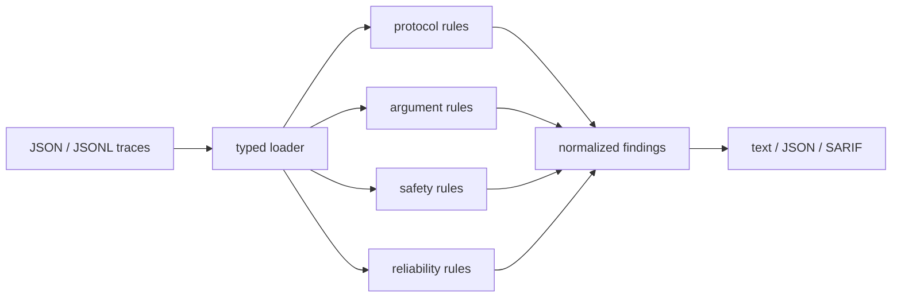

# agent-trace-lint

Agent traces are often inspected only after an evaluation fails or a production run
does something expensive. `agent-trace-lint` moves a useful subset of those checks
earlier: it statically inspects recorded conversations and tool calls without sending
data to another service.

```text
WARNING ATL302 refund-agent-42:message[2]:call[call_1] tool latency 12840 ms exceeds 10000 ms
ERROR   ATL005 refund-agent-42:message[5]:call[call_3] tool call 'lookup_order' has no result
WARNING ATL301 refund-agent-42:message[5]:call[call_3] identical tool call repeated 3 times; possible agent loop
```

## What it catches

| Area | Checks |
| --- | --- |
| Protocol | duplicate call IDs, orphan results, missing results, multiple results |
| Arguments | malformed JSON, non-object arguments, tools outside an allowlist |
| Safety | common secret formats and high-risk shell commands |
| Reliability | repeated-call loops and tool latency budget violations |

The rules are deterministic and explainable. They are intended for exported
OpenAI-style traces, test fixtures, CI artifacts, and local evaluation datasets—not
as a replacement for runtime sandboxing or policy enforcement.


## Install

Requires Python 3.11 or newer.

```bash
python -m venv .venv
source .venv/bin/activate
python -m pip install -e .
```

For development tools:

```bash
python -m pip install -e ".[dev]"
```

## Use

Lint a JSON object, JSON array, or JSONL file:

```bash
agent-trace-lint examples/broken-trace.json
```

Define the tools an agent is permitted to call:

```bash
agent-trace-lint traces.jsonl \
  --allow-tool lookup_order \
  --allow-tool issue_refund
```

Tune evaluation behavior:

```bash
# emit SARIF for code-scanning systems
agent-trace-lint traces.jsonl --format sarif > trace-results.sarif

# fail CI on warnings as well as errors
agent-trace-lint traces.jsonl --fail-on warning

# ignore an accepted finding and disable latency checks
agent-trace-lint traces.jsonl --ignore ATL302 --max-tool-latency-ms -1
```

Exit codes are `0` for a clean run, `1` when the configured severity threshold is
met, and `2` for invalid input.

## Trace shape

The loader accepts the standard nested function form and a compact equivalent:

```json
{
  "id": "support-run-17",
  "messages": [
    {
      "role": "assistant",
      "tool_calls": [
        {
          "id": "call_1",
          "function": {
            "name": "lookup_order",
            "arguments": "{\"order_id\":\"A-104\"}"
          }
        }
      ]
    },
    {
      "role": "tool",
      "tool_call_id": "call_1",
      "content": "{\"status\":\"paid\"}",
      "metadata": { "duration_ms": 82 }
    }
  ]
}
```

## Design



The package separates parsing, domain models, rule execution, and reporting so new
checks can be added without coupling them to the CLI. It uses only the Python
standard library at runtime, which keeps it suitable for CI and sensitive traces.

```text
src/agent_trace_lint/
├── cli.py          command-line behavior and exit policy
├── engine.py       rule orchestration and ignore filtering
├── io.py           JSON and JSONL normalization
├── models.py       immutable typed domain objects
├── reporters.py    text, JSON, and SARIF output
└── rules.py        protocol, safety, and reliability rules
```

## Tests

```bash
ruff check .
ruff format --check .
pytest
python -m build
```

The test suite covers input normalization, clean traces, broken tool-call lifecycles,
invalid arguments, allowlists, secret detection, risky shell commands, loop
detection, latency budgets, ignored rules, and CLI exit behavior.

## License

MIT
