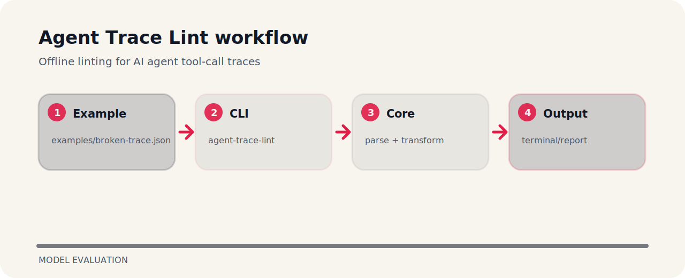

# Agent Trace Lint


## Working map



## Run it

```bash
git clone https://github.com/mertefekurt/agent-trace-lint.git
cd agent-trace-lint
python -m pip install -e ".[dev]"
agent-trace-lint examples/broken-trace.json
```

## What to notice

Offline linting for AI agent tool-call traces. It is a compact working note as much as a project: commands, file map, and the reasoning are kept close together.

| Detail | Value |
| --- | --- |
| Area | model evaluation |
| Entry | `agent-trace-lint` |
| Input | JSON document |
| Output | readable terminal output |
